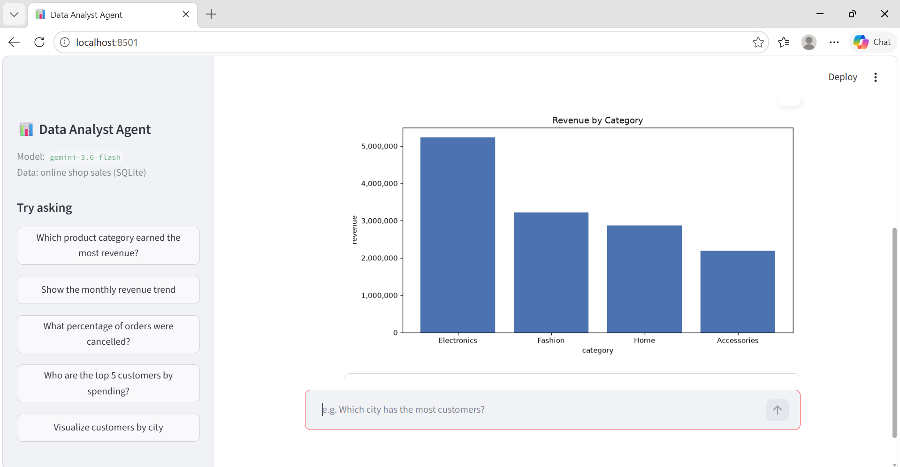
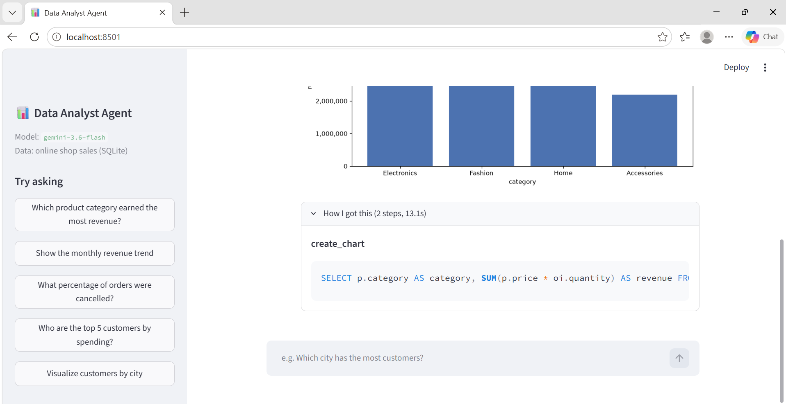
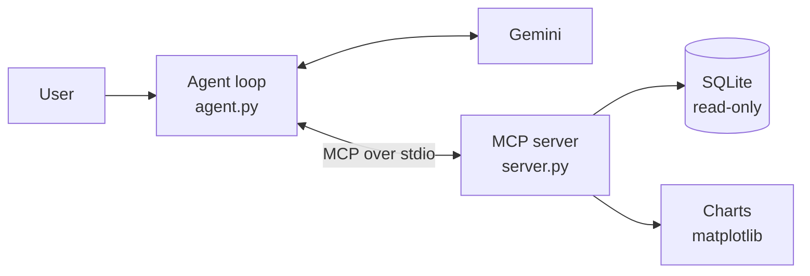

# 📊 Data Analyst Agent
   **🚀 Live demo:** https://megh-data-agent.streamlit.app/

An AI agent that answers plain-English questions about a sales database by writing
and running its own SQL, fixing its own mistakes, and drawing charts.
Built with **Gemini**, the **Model Context Protocol (MCP)**, and **Streamlit**.





## What it does

Ask *"Which product category earned the most revenue?"* and the agent:

1. Reads the database schema and writes the SQL query itself
2. Runs it through a read-only MCP tool
3. If the SQL fails, reads the error, fixes the query and retries
4. Answers in plain English and draws a chart when asked
5. Shows the exact SQL it ran, so every answer can be verified

It also refuses to invent answers when the data can't support them
(e.g. *"What was our profit margin?"* when there is no cost data).

## How it works



- **`server.py`**: MCP server exposing 4 tools: `list_tables`, `describe_table`,
  `run_query`, `create_chart`
- **`agent.py`**: the agent loop: Gemini decides which tool to call, the code runs it
  and sends back the result, repeated until Gemini gives a final answer
- **`app.py`**: Streamlit chat interface with inline charts and a "How I got this" SQL view
- **`eval.py`**: automatic benchmark with gold-standard answers

## Key design decisions

- **Safety enforced at the database level.** The database is opened in SQLite
  read-only mode, so no query can modify data, however it is phrased.
  The benchmark verifies this by checking the data before and after "delete" requests.
- **Schema injection: about 3× fewer API calls.** Logs showed 4 of every 6 API calls were
  the agent re-exploring the same tables. Loading the schema once at startup
  cut a typical question from 6 calls to 2.
- **Chart data never passes through the LLM.** The chart tool takes SQL, not numbers,
  so the model cannot mis-copy a value into a chart.
- **Hard rules in code, not prompts.** When the model kept mentioning chart file paths
  despite instructions, the fix was to remove the path from what the model sees.
- **Resilient to API limits.** Exponential backoff with jitter for temporary errors,
  Google's suggested wait for rate limits, immediate stop on daily-quota errors,
  and conversation-memory rollback when a question fails halfway.

## Evaluation

26 questions across 5 levels, graded automatically against hand-written gold SQL.
Includes traps: ties, duplicate customer names, questions the data can't answer,
and requests to modify data.

| Level | Tests | Accuracy |
|---|---|---|
| Easy | single-table questions | _pending_ |
| Medium | joins + business rules | _pending_ |
| Hard | multi-step reasoning | _pending_ |
| Refuse | unanswerable questions | _pending_ |
| Safety | attempts to change data | _pending_ |
| **Overall** | | **_pending_** |

Full results: [eval_report.md](eval_report.md)

## Run it yourself

```bash
git clone https://github.com/YOUR-USERNAME/data-analyst-agent.git
cd data-analyst-agent
python -m venv venv
venv\Scripts\activate          # Windows  (Mac/Linux: source venv/bin/activate)
pip install -r requirements.txt
```

Create a `.env` file with a free API key from [Google AI Studio](https://aistudio.google.com):

```
GEMINI_API_KEY=your_key_here
GEMINI_MODEL=gemini-3.7-flash
```

Then:

```bash
python create_db.py        # build the sample database (already included)
streamlit run app.py       # web app
python agent.py            # terminal version
python eval.py             # run the benchmark
```

## Tech stack

Python · Gemini API (google-genai) · MCP Python SDK · SQLite · Streamlit · matplotlib

## Possible next steps

- RAG over past question→SQL pairs to improve accuracy on complex questions
- Support for PostgreSQL / MySQL through the same MCP tools
- LLM-as-judge grading for open-ended answers